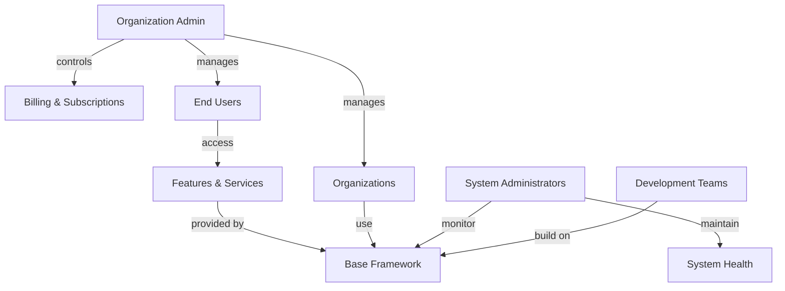

# Product Vision: Base Application Framework

## Overview
A comprehensive, reusable foundation for modern web applications that provides essential business and user management functionality. This base framework includes organization management, user authentication, role-based access control, billing integration, and a clear separation between public marketing, API services, and authenticated user interfaces.

## Target Users

### Primary
- **Development Teams**
  - Need a robust starting point for new applications
  - Want to avoid rebuilding common functionality
  - Require flexible integration points for custom features

- **Organizations (Tenants)**
  - Need to manage their users and permissions
  - Want to handle billing and subscriptions
  - Require secure access control

### Secondary
- **System Administrators**
  - Need to manage multiple organizations
  - Want to monitor system health
  - Require advanced troubleshooting capabilities

- **End Users**
  - Need secure authentication
  - Want intuitive user interfaces
  - Require role-appropriate access

### User Relationships and System Interaction

## Core Value Proposition
1. **Accelerated Development**
   - Pre-built essential functionality
   - Standardized architecture
   - Proven security patterns

2. **Flexible Foundation**
   - Modular design
   - Extensible components
   - Clear integration points

3. **Enterprise-Ready**
   - Multi-tenant architecture
   - Role-based access control
   - Professional billing integration

## Success Metrics
1. **Development Efficiency**
   - 80% reduction in setup time for new projects
   - Zero compromise of core security features
   - Minimal customization needed for basic functionality

2. **System Performance**
   - Sub-200ms API response times
   - 99.9% uptime
   - Scalable to 1000+ organizations

3. **User Experience**
   - < 3 second initial page load
   - < 300ms subsequent interactions
   - Zero-downtime updates

## Key Features

### 1. Organization Management
- Multi-tenant architecture
- Organization hierarchy support
- Tenant isolation
- Custom organization settings

### 2. User Management
- Authentication system
- User profiles
- Session management
- Password policies
- MFA support

### 3. Access Control
- Role-based permissions
- Custom role definitions
- Permission inheritance
- Access audit logs

### 4. Administration
- System user management
- Cross-organization admin tools
- System health monitoring
- Audit capabilities

### 5. Billing Integration
- Multiple provider support
- Subscription management
- Usage tracking
- Payment processing
- Invoice generation

### 6. Application Structure
- Frontend Layer
  - Marketing Interface (public)
    - Landing pages
    - Registration flow
    - Login interface
  - Authenticated Interface
    - Dashboard
    - User management
    - Settings configuration
    - Billing management
    
- Core Layers
  - Shared Layer
    - Type definitions
    - DTOs
    - Validation schemas
    - Shared utilities
  - Business Layer
    - Domain logic
    - Business rules
    - Data processing
    - Service implementations
  - API Layer
    - RESTful endpoints
    - Authentication middleware
    - Request/Response handling
    - API contracts

## Constraints & Assumptions

### Technical Constraints
- Monorepo architecture with frontend/backend/shared structure
- TypeScript for type safety across all packages
- Shared types and interfaces between frontend and backend
- REST API for communication
- Modern web standards compliance

### Business Constraints
- Must support multiple billing providers
- Must maintain strict data isolation between tenants
- Must support white-labeling capabilities
- Must be GDPR compliant

### Assumptions
- Teams using this will have TypeScript experience
- Organizations need granular permission control
- System will primarily serve B2B applications
- Authentication needs are standard OAuth2/OIDC based

## Future Considerations
1. **Extensibility**
   - Plugin system for custom features
   - Webhook integration support
   - Custom workflow engine
   - API versioning strategy

2. **Integration**
   - Additional authentication providers
   - More billing service providers
   - Third-party service connectors
   - Data import/export capabilities

3. **Advanced Features**
   - Real-time collaboration tools
   - Advanced analytics
   - Machine learning integration points
   - Automated scaling capabilities 